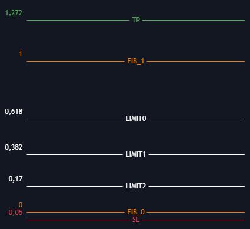

# TCL helper (for "ByBit")

TCL Helper is a program designed to monitor order placements and the status of trades based on the TCL Max strategy. 
Operating in the background, TCL Helper ensures real-time tracking of all activity related to the strategy, providing seamless management and updates. All operations are conducted through Bybit API keys.

# Key features

1. **Order Monitoring**: Tracks the placement, modification, and cancellation of orders.
2. **Trade Status Updates**: Continuously monitors the status of active trades, including entry and exit conditions.
3. **Background Operation**: Runs unobtrusively, allowing users to focus on other tasks while maintaining full oversight of trades.

# Launch

Before first running, make sure Python version 3.10.11 is not installed. The program is launched through the `launch.bat` file for Windows. Two personal API keys are required, which can be created at [Bybit API Management](https://www.bybit.com/app/user/api-management). Once obtained, the keys should be added to the `_system/config.py` file for proper configuration.

To create a trade the following data is required:

1. **Token name** (e.g., ADAUSDT)
2. **Price at Fibonacci Level 1**
3. **Price at Fibonacci Level 0**

